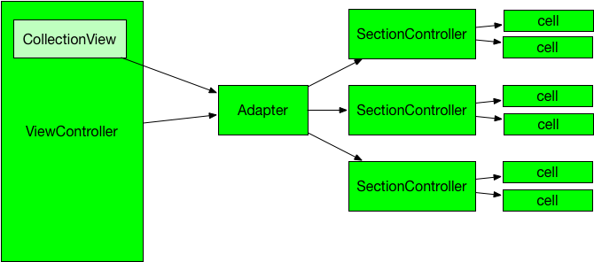

IGListKit是一个数据驱动的UICollectionView框架，用于构建快速和灵活的列表。这个框架设计的非常好，完美符合高内聚、低耦合，这个解耦思路可以借鉴。它是一个很典型的使用 Objective-C 开发的，但却是个偏向使用 Swift 语言开发者的一个 UI 组件库。这里尽可能用通俗易懂的方式来描述。

master

##### 1、安装

可以通过cocoaPods安装这个组件,在podfile中添加：

```
target 'yourProjectName' do
  use_frameworks!
  pod 'IGListKit'
end
```

##### 2、如何使用或者说如何从UICollectionView迁移

原来的做法：在原来的UICollectionViewController里的写法，我们一定都会实现UICollectionDataSource和UICollectionViewDelegate来细化数据源和用户交互响应等，详细的可以参考相关文档这里就不赘述。

IGListKit的做法：



- 创建section controller,继承IGListSectionController，遵循IGListSectionType协议

  一个 section controller 是一个抽象的对象，指定一个数据对象，它负责配置和管理 CollectionView 中的一个 section 中的 cell。这个概念类似于一个用于配置一个 view 的 view-model：数据对象就是 view-model，而 cell 则是 view，section controller 则是二者之间的粘合剂。在 IGListKit 中，根据不同类型的数据的类型和特性创建不同的 section controller

```
class LabelSectionController: IGListSectionController, IGListSectionType {
  // ...
}
```

- 创建UI

  使用 UICollectionView，你需要某个数据源实现 UICollectionViewDataSource 协议。它的作用是返回 section 和 row 的数目以及每个 cell。 
  在 IGListKit 中，你使用一个 GListAdapter 来控制 collection view。你仍然需要一个数据源来实现 IGListAdapterDataSource 协议，但不是返回数字或 cell，你需要提供数组和 controllers

```
let layout = UICollectionViewFlowLayout()
let collectionView = IGListCollectionView(frame: CGRect.zero, collectionViewLayout: layout)

let updater = IGListAdapterUpdater()
let adapter = IGListAdapter(updater: updater, viewController: self, workingRangeSize: 0)
adapter.collectionView = collectionView
adapter.dataSource=self
```

- 连接数据源（实现objects、listAdapter和emptyView方法）

```
func objects(for listAdapter: IGListAdapter) -> [IGListDiffable] {
        //数据源
        var items:[IGListDiffable] = [wxScanner.currentWeather]
        items+=loader.entries as [IGListDiffable]
        items+=pathfinder.messages as [IGListDiffable]
        return items.sorted(by: { (left: Any, right: Any) ->Bool in
            if let left = left as? DateSortable,let right = right as? DateSortable{
                return left.date > right.date
            }
            return false
        })
    }
    
    func listAdapter(_ listAdapter: IGListAdapter, sectionControllerFor object: Any) -> IGListSectionController {
   //根据不同数据源来返回对应的section controller 
        if object is Message{
            return MessageSectionController()
        }else if object is Weather{
            return WeatherSectionController()
        }else{
            return JournalSectionController()
        }
    }

    func emptyView(for listAdapter: IGListAdapter)->UIView?{
    //当list是空的时候显示的视图
        return nil
    }

```

- 在section Controller中实现IGListSectionType协议要求必须实现的方法，实际上UICollectionDataSource和UICollectionViewDelegate的方法通过adapter在section controller中用下列方法实现

```
 func numberOfItems() -> Int {
        return 1
    }
    
    func sizeForItem(at index: Int) -> CGSize {
        guard let context = collectionContext else{
            return .zero
        }
        return MessageCell.cellSize(width: context.containerSize.width, text: message.text)
    }
    
    func cellForItem(at index: Int) -> UICollectionViewCell {
        let cell = collectionContext?.dequeueReusableCell(of: MessageCell.self, for: self, at: index) as! MessageCell
        cell.messageLabel.text = message.text
        cell.titleLabel.text = message.user.name.uppercased()
        return cell
    }
    
    func didUpdate(to object: Any) {
        message = object as? Message
    }
    
    func didSelectItem(at index: Int) {
        
    }

```

- section controller 布局方式

  这个方法在每个 JournalSectionController 对象的下方增加 15 个像素的间距，根据具体情况可以自己设置。保证上下cell之间有15个像素的空间

```
override init(){
        super.init()
        inset = UIEdgeInsets(top: 0, left: 0,bottom: 15, right: 0)
    }
```

3、高级特性

- Diffing算法

  相比于前端各种各样 Virtual DOM diff 实现，移动端在这方面较为欠缺。在 UITableView 和 UICollectionView 的使用上，一旦同时发生数据删除，更新，添加时，我们的做法往往是手动计算出变化 NSIndexPaths并调用批量刷新，甚至简单粗暴地调用 reloadData 做一次全刷新。而IGListKit 的 IGListDiff正是为这种场景而生：当数据变化产生后，通过调用 [IGListDiff](https://github.com/Instagram/IGListKit/blob/master/Source/Common/IGListDiff.mm) 自动计算前后两次的差值，为后续批量刷新提供数据。整个算法的复杂度为 O(n)，相当高效。

  算法介绍：

  IGListDiff 使用一个额外的哈希表和两个新旧哈希列表 hash entry list使得比较的算法复杂度从 O(n^2) 变成 O(n)，一个hash entry定义如下：

  ```
  /// Used to track data stats while diffing.
  struct IGListEntry {
      /// The number of times the data occurs in the old array
      NSInteger oldCounter = 0;
      /// The number of times the data occurs in the new array
      NSInteger newCounter = 0;
      /// The indexes of the data in the old array
      stack<NSInteger> oldIndexes;
      /// Flag marking if the data has been updated between arrays by checking the isEqual: method
      BOOL updated = NO;
  };
  ```

  然后进行比较操作，主要是四步：

  - 遍历新队列，计算对象 `hash` 值并找到对应 `entry` ，使得 `newCount++`，同时计入 `new entry list`
  - 遍历旧队列，计算对象 `hash` 值并找到对应 `entry` ，使得 `oldCount++`，同时将当前序号入栈 `oldIndexes.push(i)`，并记录 `old entry list`
  - 遍历 `new entry list`，检查 `entry` 对应的 `oldIndexes` 信息，如果堆栈中有旧队列序号值，则表示当前 `entry` 至少对应新旧队列中的两个对象，即发生所谓的 `entry match`，`进行记录，方便后续反向查询`。再通过检查 `新队列当前对象` 和 `entry 对应旧对象` 是否相同确认 `update` 状态。
  - 再次遍历新旧 `entry list`，检查每个 `entry` 的 `entry match` 状态
    - 没有 `entry match` 的对象，在新队列中的被标记为 `insert`，而在旧队列中的则被标示为 `delete`
    - 有 `entry match` 的对象通过比较新旧队列序号和 `update` 状态分表表示为 `update`，`move`和 `not modified`

  举个栗子:

  以旧数组 `[1,2,3]` 和新数组 `[1,3,5]` 为例 （数字比较直接忽略 `update` 状态）

  - 遍历新数组，得到 `[entry1,entry3,entry5]` 列表，记为 `nl`
  - 遍历旧数组，得到 `[entry1,entry2,entry3]` 列表，记为 `ol`
  - 遍历 `nl`，由于 `entry1 oldIndexs = [0]`，`entry3 oldIndexes = [2]` 所以他们是 `entry match`，做记录 （`reverse lookup`）
  - 遍历 `ol`
    - `entry1` 有 `entry match`，跳过
    - `entry2` 没有 `entry match`，记为 `delete`
    - `entry3` 有 `entry match`，跳过
  - 遍历 `nl`
    - `entry1` 有 `entry match`，同时相对位置不变，记为 `not modified` (其实就是跳过)
    - `entry3` 有 `entry match`，但是相对位置变化，记为 `move`
    - `entry5` 没有 `entry match`，记为 `insert`
  - 输出一个包含 `insert`，`move`，`delete` 和 `update` 列表信息的最终结果

- working range

working range是一个离可视区域之外的前后距离，这可以让section controllers在进入屏幕之前准备显示的内容，如预下载和预渲染等操作。

```
let adapter = IGListAdapter(updater: IGListAdapterUpdater(),
                     viewController: self,
                   workingRangeSize: 0.5) // 0.5  the workingRange size
```

同时有IGListWorkingRangeDelegate协议，提供sectionControllerWillEnterWorkingRange和sectionControllerDidExitWorkingRange方法分别是进入working range和离开working range区域执行的方法

3、栗子

本文的demo来自于网上的一个教程，依照教程的方法把UICollectionView迁移到IGListKit。同时库自身带有很多栗子可以参考学习。
